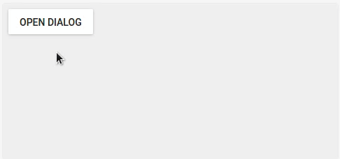

# material-ui-fullscreen-dialog

[](https://greenkeeper.io/)
This project provides a [fullscreen dialog][dialogspec] for [Material-UI][mui].



If you want to try the component yourself instead of watching a gif, head over to [the storybook][gh-pages] for a live demo!

## Installation
```shell
npm i --save material-ui-fullscreen-dialog
```

## Usage


```jsx
import FullscreenDialog from 'material-ui-fullscreen-dialog'

<FullscreenDialog
  open={this.state.open}
  onRequestClose={() => this.setState({ open: false })}
  title={'Demo dialog'}
  actionButton={<FlatButton
    label='Done'
    onTouchTap={() => this.setState({ open: false })}
  />}
>
  // dialog content here
</FullscreenDialog>
```

## Properties
| Name | Type | Default | Description |
| --- | --- | --- | --- |
| actionButton | `node` | | A `FlatButton` or `IconButton` that is used as affirmative action button. |
| appBarStyle | `object` | | Overrides the inline-styles of the app bar. | 
| children | `node` | | Children elements. |
| closeIcon | `node` | Close icon | Icon element used for the dismissive action. This is hidden if `onRequestClose` is not set. |
| containerStyle | `object` | | Overrides the inline-styles of the dialog's children container. |
| onRequestClose | `function` | | Callback that is invoked when the dismissive action button is touched. |
| open * | `bool` | | Controls whether the dialog is opened or not. |
| style | `object` | | Overrides the inline-styles of the dialog's root element. |
| title | `string` | | The title of the dialog. |
| titleStyle | `object` | | Overrides the inline-styles of the app bar's title element. |

\* required property

## Credits
The code for the animation was adapted from Material UI's [Dialog][mui-auto-complete], although the animation itself is different.

## License
The files included in this repository are licensed under the MIT license.

[dialogspec]: https://material.io/guidelines/components/dialogs.html#dialogs-specs
[mui]: http://www.material-ui.com/#/
[gh-pages]: https://teamwertarbyte.github.io/material-ui-fullscreen-dialog/
[Dialog]: https://github.com/callemall/material-ui/blob/master/src/Dialog/Dialog.js
